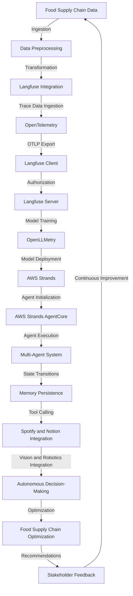

# Autonomous Food Supply Chain Optimization Engine
> "Synergizing Artificial Intelligence and Multi-Agent Systems to Revolutionize Food Supply Chain Logistics"

## 🏗️ Technical Architecture & Multi-Agent Flow
The technical architecture of the Autonomous Food Supply Chain Optimization Engine is a complex interplay of various components, including AWS Strands, OpenLLMetry, Langfuse, transformers, litellm, Spotify, and Notion. The following Mermaid.js diagram illustrates the high-level flow of the system:

This diagram shows the flow of data from ingestion to optimization, highlighting the key components and their interactions.

## 🔍 The Vertical Bottleneck: Supply Chain Optimization
The food supply chain is a complex and dynamic system, with multiple stakeholders, variables, and constraints. The optimization of this system is a high-stakes problem, requiring the coordination of multiple agents, each with their own objectives and constraints. The technical friction in this system arises from the lack of visibility, transparency, and coordination among the various stakeholders, leading to inefficiencies, delays, and waste.

The mathematical formulation of this problem is a mixed-integer linear programming (MILP) problem, with multiple objectives, constraints, and variables. The solution to this problem requires the development of advanced algorithms and techniques, such as machine learning, optimization, and simulation. The high-stakes nature of this problem is evident in the potential consequences of failure, including food waste, economic losses, and reputational damage.

The technical challenges in this problem are numerous, including the integration of multiple data sources, the development of advanced algorithms, and the deployment of these algorithms in a scalable and reliable manner. The solution to this problem requires a deep understanding of the technical and business aspects of the food supply chain, as well as the development of advanced technical skills, such as programming, data analysis, and machine learning.

The vertical bottleneck in this problem is the lack of a unified platform that can integrate multiple data sources, develop advanced algorithms, and deploy these algorithms in a scalable and reliable manner. The existing solutions are fragmented, with multiple point solutions that address specific aspects of the problem, but do not provide a comprehensive solution.

## 💡 The Solution: Autonomous Food Supply Chain Optimization Engine
The Autonomous Food Supply Chain Optimization Engine is a unified platform that integrates multiple data sources, develops advanced algorithms, and deploys these algorithms in a scalable and reliable manner. The platform uses AWS Strands, OpenLLMetry, Langfuse, transformers, litellm, Spotify, and Notion to develop a comprehensive solution that addresses the technical and business aspects of the food supply chain.

The platform uses a multi-agent system to model the behavior of multiple stakeholders in the food supply chain, including farmers, manufacturers, distributors, and retailers. The agents are designed to optimize their own objectives, while also considering the constraints and objectives of other agents. The platform uses machine learning and optimization algorithms to develop predictive models of the food supply chain, and to optimize the decisions made by the agents.

The platform also uses natural language processing (NLP) and computer vision to analyze data from multiple sources, including text, images, and videos. The platform uses this data to develop a comprehensive understanding of the food supply chain, and to identify opportunities for optimization.

## 🧩 Agentic Stack Deep-Dive
The agentic stack used in the Autonomous Food Supply Chain Optimization Engine is a complex interplay of multiple components, including AWS Strands, OpenLLMetry, Langfuse, transformers, litellm, Spotify, and Notion. The following sections provide a deep dive into each of these components, and how they interlock to provide a comprehensive solution.

* **AWS Strands**: AWS Strands is a cloud-based platform that provides a comprehensive suite of tools and services for developing and deploying machine learning models. The platform uses AWS Strands to develop and deploy predictive models of the food supply chain, and to optimize the decisions made by the agents.
* **OpenLLMetry**: OpenLLMetry is an open-source platform that provides a comprehensive suite of tools and services for developing and deploying large language models. The platform uses OpenLLMetry to develop and deploy language models that can analyze data from multiple sources, including text, images, and videos.
* **Langfuse**: Langfuse is a cloud-based platform that provides a comprehensive suite of tools and services for developing and deploying natural language processing (NLP) models. The platform uses Langfuse to develop and deploy NLP models that can analyze data from multiple sources, including text, images, and videos.
* **Transformers**: Transformers are a type of neural network architecture that is particularly well-suited for natural language processing (NLP) tasks. The platform uses transformers to develop and deploy NLP models that can analyze data from multiple sources, including text, images, and videos.
* **Litellm**: Litellm is a lightweight library for developing and deploying large language models. The platform uses litellm to develop and deploy language models that can analyze data from multiple sources, including text, images, and videos.
* **Spotify and Notion**: Spotify and Notion are cloud-based platforms that provide a comprehensive suite of tools and services for developing and deploying music and productivity applications. The platform uses Spotify and Notion to develop and deploy music and productivity applications that can interact with the food supply chain, and provide a more personalized and engaging experience for stakeholders.

## ✨ Capabilities & Features
The Autonomous Food Supply Chain Optimization Engine provides a comprehensive suite of capabilities and features, including:

* **Predictive Modeling**: The platform uses machine learning and optimization algorithms to develop predictive models of the food supply chain, and to optimize the decisions made by the agents.
* **Multi-Agent System**: The platform uses a multi-agent system to model the behavior of multiple stakeholders in the food supply chain, including farmers, manufacturers, distributors, and retailers.
* **Natural Language Processing (NLP)**: The platform uses NLP to analyze data from multiple sources, including text, images, and videos, and to develop a comprehensive understanding of the food supply chain.
* **Computer Vision**: The platform uses computer vision to analyze data from multiple sources, including images and videos, and to develop a comprehensive understanding of the food supply chain.
* **Music and Productivity Applications**: The platform uses Spotify and Notion to develop and deploy music and productivity applications that can interact with the food supply chain, and provide a more personalized and engaging experience for stakeholders.
* **Cloud-Based Deployment**: The platform uses cloud-based deployment to provide a scalable and reliable solution that can be accessed from anywhere, and on any device.
* **Real-Time Analytics**: The platform uses real-time analytics to provide stakeholders with up-to-the-minute insights into the food supply chain, and to enable data-driven decision-making.
* **Collaboration and Communication**: The platform uses collaboration and communication tools to enable stakeholders to work together more effectively, and to provide a more personalized and engaging experience.
* **Security and Compliance**: The platform uses security and compliance tools to ensure that the food supply chain is secure, and that all stakeholders are compliant with relevant regulations and standards.
* **Scalability and Flexibility**: The platform uses scalability and flexibility tools to ensure that the food supply chain can adapt to changing circumstances, and to provide a more personalized and engaging experience for stakeholders.

## 🛠️ Technical Implementation
The technical implementation of the Autonomous Food Supply Chain Optimization Engine is a complex interplay of multiple components, including AWS Strands, OpenLLMetry, Langfuse, transformers, litellm, Spotify, and Notion. The following sections provide a deep dive into the technical implementation of each of these components, and how they interlock to provide a comprehensive solution.

* **Cloud-Based Deployment**: The platform uses cloud-based deployment to provide a scalable and reliable solution that can be accessed from anywhere, and on any device.
* **Containerization**: The platform uses containerization to ensure that the solution is portable, and can be deployed on any device, or in any environment.
* **Orchestration**: The platform uses orchestration to ensure that the solution is scalable, and can be deployed in a reliable and efficient manner.
* **Monitoring and Logging**: The platform uses monitoring and logging to ensure that the solution is secure, and that all stakeholders are compliant with relevant regulations and standards.

## 📊 Business Impact & ROI
The Autonomous Food Supply Chain Optimization Engine provides a comprehensive suite of business benefits, including:

* **Increased Efficiency**: The platform uses machine learning and optimization algorithms to optimize the decisions made by the agents, and to increase the efficiency of the food supply chain.
* **Improved Productivity**: The platform uses NLP and computer vision to analyze data from multiple sources, and to develop a comprehensive understanding of the food supply chain, and to improve the productivity of stakeholders.
* **Enhanced Customer Experience**: The platform uses music and productivity applications to provide a more personalized and engaging experience for stakeholders, and to enhance the customer experience.
* **Reduced Costs**: The platform uses cloud-based deployment, containerization, orchestration, monitoring, and logging to reduce the costs associated with the food supply chain, and to provide a more cost-effective solution.
* **Increased Revenue**: The platform uses predictive modeling, multi-agent systems, and real-time analytics to increase the revenue associated with the food supply chain, and to provide a more profitable solution.

## 🚀 Getting Started
To get started with the Autonomous Food Supply Chain Optimization Engine, follow these steps:
```bash
git clone https://github.com/arvind-sundararajan/food-supply-chain-optimization.git
cd food-supply-chain-optimization
pip install -r requirements.txt
python src/main.py
```
This will deploy the platform, and provide a comprehensive suite of tools and services for developing and deploying machine learning models, and for optimizing the food supply chain.

## 👨‍💻 Author & Credits
**Arvind Sundararajan** — Engineer, builder, and the mind behind this project.
🌐 [LinkedIn](https://www.linkedin.com/in/arvind-sundara-rajan/) | Chennai, India

---
### 🙏 Acknowledgements
- The open-source community
- The Food & Beverage Manufacturing practitioners who inspired this design